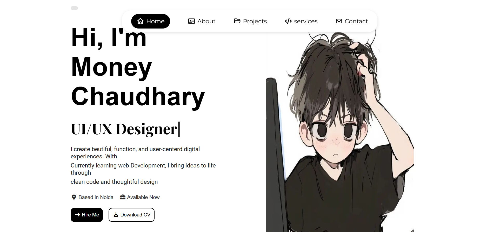

# 🌐 Personal Portfolio



## 👋 About The Project

This is my **personal portfolio website** where I showcase my skills, projects, and experience as a **UI/UX designer and aspiring web developer**.

The portfolio highlights my work, design approach, and projects while providing an easy way for visitors to contact me.

The goal of this project is to create a **clean, modern, and responsive portfolio website** that represents my personal brand and development journey.

---

## 🚀 Features

- 🏠 Modern Hero Section
- 📱 Fully Responsive Design
- 🧑 About Me Section
- 💼 Projects Showcase
- 🛠 Services Section
- 📬 Contact Section
- 🌙 Dark Mode Toggle
- 🎨 Clean UI/UX Design

---

## 🛠 Tech Stack

- **HTML5**
- **CSS3**
- **JavaScript**
- **Responsive Web Design**

---

## 📸 Preview

Below is a preview of the portfolio homepage.


---

## 📂 Project Structure

Portfolio/
│

├── index.html

├── style.css

├── script.js

├── images/

└── README.md


---

## ⚡ Getting Started

### 1️⃣ Clone the repository

```bash
git clone https://github.com/Moneyy02/Portfolio.git
,

2️⃣ Open the project

3️⃣ Run the project

Simply open index.html in your browser.
