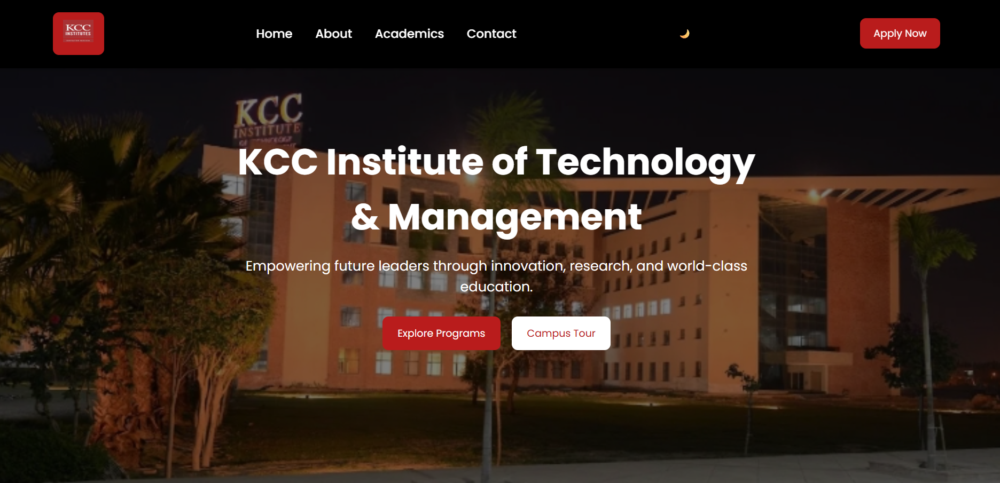
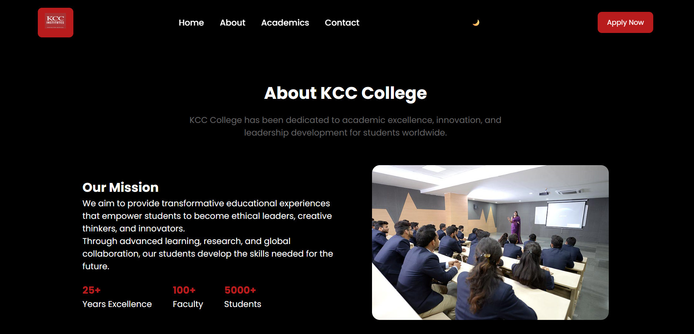
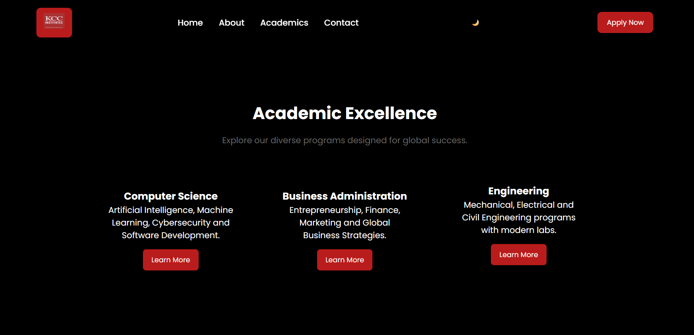

# 🎓 KCC Institute College Website

A modern **college landing page website** built using **HTML, CSS, and JavaScript** as part of a Full Stack Development assignment.

The website represents **KCC Institute of Technology & Management** and demonstrates a clean UI with modern web design principles.

---

# 🚀 Features

- Modern **Hero Section**
- Responsive **Navigation Bar**
- **Dark Mode Toggle**
- About College Section
- Academic Programs Section
- Contact Section
- Clean UI Design
- Responsive Layout

---

# 🛠 Tech Stack

- HTML5
- CSS3
- JavaScript

---

# 📸 Website Preview

## Hero Section

---

## About Section

---

## Academics Section

---

