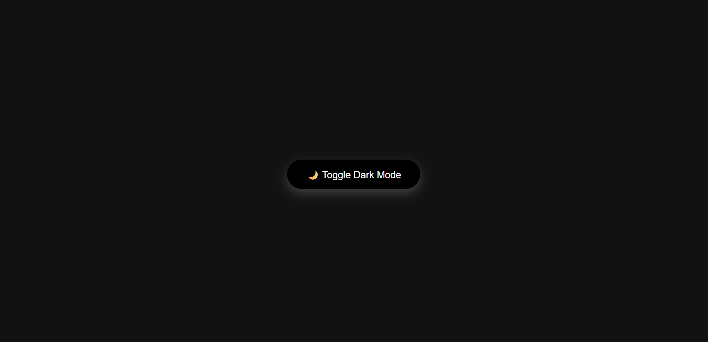
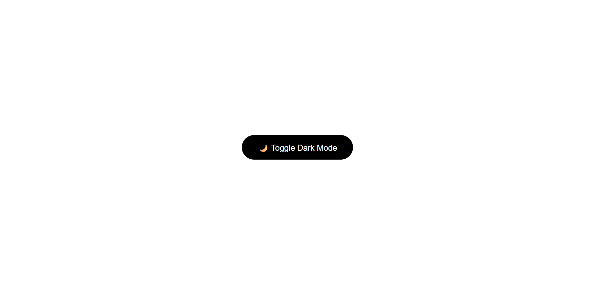

# 🌙 Dark Mode Toggle

A simple **Dark Mode Toggle UI** built using **HTML, CSS, and JavaScript**.

This project demonstrates how a button can switch between **light mode and dark mode** by dynamically changing styles on the webpage.

Dark mode features are widely used in modern web applications because they reduce eye strain and improve readability in low-light environments.

---

# 🚀 Features

- 🌙 Dark Mode Toggle Button
- ⚡ Smooth UI animation
- 🎨 Modern glowing button design
- 🖥 Minimal UI
- 📱 Responsive layout

The theme toggle works by adding or removing a CSS class (like `dark-mode`) on the webpage and updating the styles accordingly. :contentReference[oaicite:1]{index=1}

---

# 🛠 Tech Stack

- **HTML5**
- **CSS3**
- **JavaScript**

---

# 📸 Project Preview

## Before (Light Mode)

---

## After (Dark Mode)

---

# 📂 Project Structure
