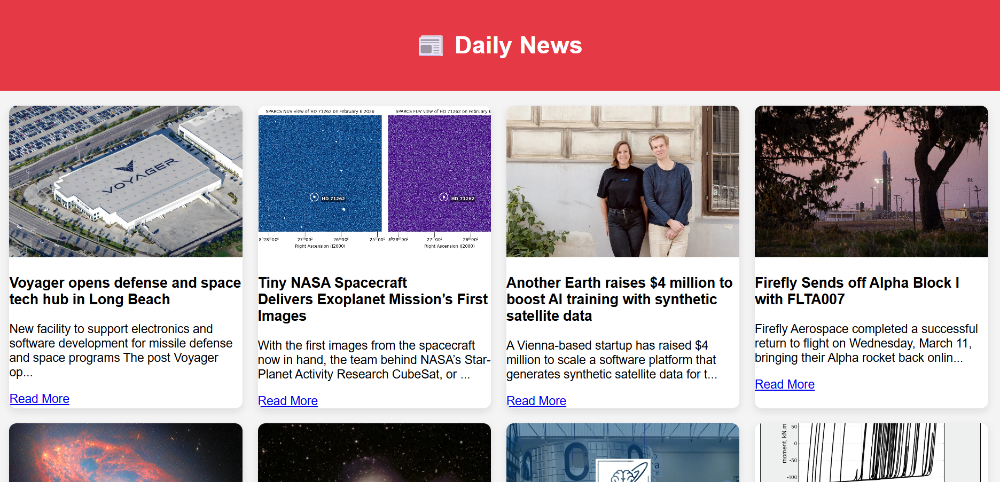

# 📰 News App

A simple **News Website** built using **HTML, CSS, and JavaScript** that fetches and displays the latest news articles dynamically using a public news API.

The application demonstrates how to work with APIs and dynamically render content on a webpage using JavaScript.

---

## 🖼️ Project Preview

---

## 🚀 Features

- 📰 Fetches **latest news articles using API**
- 🖼️ Displays **news images**
- 📝 Shows **news title and summary**
- 🔗 **Read More** button redirects to the full article
- ⚡ Dynamic content loading using **Fetch API**
- 📱 Responsive **card-based layout**

---

## 🛠️ Tech Stack

- **HTML5**
- **CSS3**
- **JavaScript**
- **Public News API**

Modern web apps often use APIs to fetch data dynamically and update the UI without reloading the page. This project demonstrates the basic concept of API integration and dynamic content rendering in JavaScript. :contentReference[oaicite:1]{index=1}

---

## 📂 Project Structure
